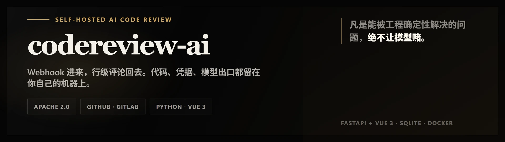
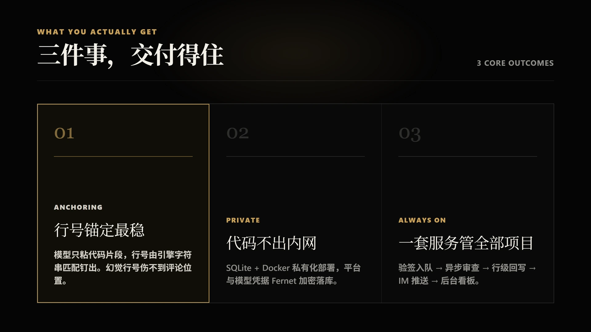

<div align="center">

# codereview-ai

**Self-hosted AI code review. Webhook in, inline comments out.**




</div>

<p align="center">
🇺🇸 <a href="./README.en.md">English</a> | 🇨🇳 <a href="./README.md">简体中文</a>
</p>

## What this is

A code review service that runs on your own machine. Point a webhook at it from GitHub, GitLab or Gitee, and every PR / MR that opens or updates gets reviewed automatically — findings land as inline comments on the exact changed lines, and get pushed to DingTalk / Feishu / WeCom. If a webhook never arrives, or a batch of PRs was already open when you onboarded the project, the admin panel can sweep the platform and pull them in. Models, projects, permissions and stats are all configured from the bundled Vue admin panel.

## Why it exists

For how it reviews, it sits on the "**deterministic engineering × an agent that goes read the repo**" axis: *anything the engineering can decide for certain, the model never has to gamble on.* Line numbers are pinned by the engine with pure string matching over the code snippet the model pastes back, so a hallucinated line number cannot push a comment off-target. File grouping is cut to hard ceilings and the LLM only makes a closed-book grouping judgment. If the agent goes exploring and anything at all goes sideways, the whole review drops back to diff — an agent failure is never recorded as a task failure.

That baseline wasn't built from nothing — which parts can safely be left to the model and which must be shored up by deterministic engineering came from studying this exact family of tools. Its lineage: the diff / agent dual-tracks and the "model pastes a snippet, never a line number" anchoring are ported straight from **open-code-review** (Alibaba) — its grouping / plan gate / budget gate / resolver; the cross-group content-fingerprint de-dup follows **pr-agent**'s *body_fp OR code_fp*; and the "webhook in → async queue → inline write-back + IM push + self-hosted admin" platform shape is closest to **AI-Codereview-Gitlab**.

**Strengths**



- **The most robust line anchoring** — the model only pastes a code snippet and the engine pins the line. OCR is "model gives a line + post-hoc relocation"; this project never accepts a line number from the model at all. That is the sharpest split from tools like pr-agent that take inline positions from model line numbers — a hallucinated coordinate never even enters the comment.

- **One service that runs every project** — not a "run once per PR" Action but a resident service: webhook verification → async queue → inline write-back, with multi-project, backfill polling, crash replay and a per-project on/off in one admin panel. Value: events don't get lost, state is recoverable, team-level operation.

- **Nothing falls through** — a webhook that never arrived, events during a restart, PRs already open before you onboarded the project: pull them back by hand, or schedule a poll that scans every enabled project on an interval. Heads already reviewed are skipped. Value: this is the resident service's core edge over an Action.

- **An agent failure is never an incident** — agentic whole-repo reasoning is read-only; any hitch drops the whole review back to diff. OCR also degrades gracefully, but it has no service-level guarantee of "fall back to the diff, a sure conclusion". Value: there's always a deliverable conclusion — a "task failed" with no one owning it never happens.

- **Code stays inside** — SQLite + Docker self-hosted deployment; platform and model credentials are Fernet-encrypted at rest and hot-reload the moment you save them. Value: enterprise onboarding, especially finance, government, and mid-to-large teams.

- **A three-layer pipeline, fused on demand** — LLM diff review, optional agentic whole-repo reasoning, and semgrep static analysis merge into one set of findings; but you don't run all three for every PR — LLM + semgrep by default, agentic triggered on high-risk / large PRs. Value: coverage, determinism and cost in one, without making the user face three reports.

- **A minimal admin loop** — dashboard, review records, projects, IM notifiers, clone cache don't all need to exist; the essentials are project config, review records, manual backfill, credential management and IM setup. Value: operable, diagnosable, closes the loop.

- **No paying twice across rounds** — unchanged files between adjacent rounds are reused by content hash; a one-shot review has no "previous round" to reuse. Value: saves money on high-frequency PRs, but the cache key must include the model, the rules and the config version.

## How it works

Webhook events are HMAC-verified, written to an async queue, and answered `202` — the request never waits on a review. Polling uses the same queue: it calls the platform API to list open PRs / MRs, records a `queued` row for each one not yet reviewed, and returns just as fast. The worker pool picks the task up, hands the diff to the LLM review layer, and layers semgrep and agentic whole-repo analysis on top depending on your switches, then fuses and de-duplicates the three sets of findings.

The result is written back through the forge API as inline comments and persisted for the admin dashboards and the daily report. Nothing external takes part in scheduling.

## Two review modes

Both paths share the same queue, the same write-back and the same stats. The only difference is **how much the model gets to see**. Each project picks its own, `diff` by default; `agentic` additionally needs `CR_AGENT_REVIEW_ENABLED` on globally.

### diff — read only what changed

The diff is reviewed as-is, without touching the repository. Files are grouped first: small changes (few files and low total churn) are lazily bundled into one group; larger ones buy one cheap "paths and line counts only" call for semantic clustering that pulls related files together (degrading to one file per group on failure), and the result is then cut to hard ceilings (≤10 files, ≤1000 churn lines per group). Groups are reviewed concurrently, and findings are merged and de-duplicated on a content fingerprint of file plus finding text.

The load-bearing convention here is that **the model never reports line numbers** — the prompt asks it to paste the offending code back verbatim, and the engine anchors it: a consecutive match inside the diff hunks first (new side, then old), then a fallback scan of the whole new file, and only then a search across other files — where a *unique* hit is required, because two hits means guessing. A hallucinated line number therefore cannot land a comment in the wrong place. Findings that can't be anchored, or anchor outside a commentable hunk, are never dropped; they fold into the summary comment. Files over 600 changed lines or 20 KB of diff are skipped, and the skip list goes into the summary too rather than vanishing.

### agentic — go read the repo, with tools

A signature that changed while a caller didn't, a state assumption that spans files — the diff alone can't show you those, so the model has to read the repository itself. Once enabled, the agent gets six **read-only** tools: read a line range (≤500 lines), fixed-string `git grep` (≤100 hits), find files by name, read the parsed diff, submit findings, end the session. No shell, no network, no writes.

The repository is one **bare clone** per repo (incrementally fetched under a cross-platform file lock, in whatever cache directory you configured), and every read goes through `git cat-file blob <head sha>:<path>` — there is no working tree to escape, and two PRs can't knock over each other's checkout. Sessions run per file group, each with its own context, capped at 20 turns / 300 seconds / 80k prompt tokens. Running out doesn't just stop the session: a grace round is injected with only "submit findings" and "finish" available, forcing the model to hand over what it has. Context compaction starts in the background at 60% and synchronously at 80%, and a failed compaction returns the messages untouched rather than truncating them into half a JSON object.

The full per-group pipeline: a plan for large changes first (triggered only at ≥300 churn lines in one file, or ≥600 across the group) → the main loop reading code → re-anchoring for findings with no line (deterministic match → unique cross-file match → let the model re-pick the snippet) → a fact check that deletes findings the diff provably contradicts (the only stage that removes anything) → cross-group de-duplication → one 0-100 score. Every LLM call is persisted with its stage, so the admin panel can replay the whole exchange as swim lanes.

### Anything goes wrong, it falls back to diff

Sandbox off, `git` not on PATH, clone unreachable, target commit not fetchable, grouping failed, the agent reporting FAILED itself — any of these drops the whole review back to plain diff review rather than turning an agent failure into a task-level `failed`. An agent that submits nothing at all on a non-trivial diff gets the same treatment: an empty success is never accepted as a conclusion. What's recorded is the path that **actually ran**, so Agent-vs-diff on the dashboard is honest accounting.

## Quick start

```bash
git clone https://github.com/zhansan379/codereview-ai.git
cd codereview-ai

# Start from the annotated template: every env var + zh/en notes,
# common ones enabled, uncommon ones commented out
cp .env.example .env

# Or write it by hand — these four secrets have no defaults, the app fail-fasts without them
cat > .env <<'EOF'
CR_SECRET_KEY=<generate with the commands below>
CR_WEBHOOK_SECRET=<generate with the commands below>
CR_ENCRYPTION_KEY=<generate with the commands below>
CR_ADMIN_PASSWORD=<generate with the commands below>
EOF

docker compose up -d
open http://localhost:5001/admin
```

Generating them:

```bash
python -c 'import secrets;print(secrets.token_urlsafe(48))'                          # SECRET_KEY / WEBHOOK_SECRET
python -c 'from cryptography.fernet import Fernet;print(Fernet.generate_key().decode())'  # ENCRYPTION_KEY
python -c 'import secrets;print(secrets.token_urlsafe(24))'                          # ADMIN_PASSWORD
```

> `CR_ENCRYPTION_KEY` must be a valid 32-byte urlsafe-base64 Fernet key — `secrets.token_urlsafe` will not do.

Sign in, configure a model and a forge, then add a webhook pointing at `POST http://<your-host>:5001/webhook` and open a PR.

Docs:

- [GitHub onboarding guide](docs/how_use_github.md)
- [Gitee onboarding guide](docs/how_use_gitee.md)
- [Scheduled pull (backfill)](docs/how_use_poll.md)
- [Use PostgreSQL storage (standard tier)](docs/how_use_postgres.md)
- [WeCom group robot webhook](https://www.tencentcloud.com/zh/document/product/1254/78645) (Chinese)

## Install

Without Docker:

```bash
uv sync
uv run uvicorn codereview_ai.main:app --host 0.0.0.0 --port 5001
```

The admin panel is at `/admin`, interactive API docs at `/docs` (`CR_OPENAPI_ENABLED=0` turns them off), health probe at `/health`.

Building the frontend yourself:

```bash
cd frontend && npm install && npm run build   # output goes to frontend/dist, served under /admin
```

Development and quality gates:

```bash
uv run ruff check src tests
uv run mypy src
uv run pytest tests --cov=codereview_ai --cov-fail-under=70
```

Coverage gate is 70% overall and 83% for the core modules (`forges` / `review` / `worker` / `queue` / `storage`); CI also runs `pip-audit`.

Full configuration reference and API surface live in `/docs`.

## Roadmap

What is planned next, in priority order.

**Doing next**

- [ ] **Project-level rule engine** — inject additional review rules matched by `path` / glob, first match wins, so review policy can be configured per directory and per file. The schema is already in place (the `ProjectRule` table carries `path_glob` / `priority` / `system_merge`) but nothing references it yet: it needs a repository layer, an admin API, and the match-and-inject step at review time.
- [ ] **Native suggestion blocks** — render the `suggestion_code` we already capture as GitHub `suggestion` fences (`start_line` for multi-line) so a fix can be applied from the diff in one click instead of only read.
- [ ] **Four review voices** — professional / sarcastic / gentle / humorous, wording only, never the score. The config field and plumbing exist; the per-voice prompt presets do not.
- [ ] **standard queue tier** — Redis + arq for multi-instance deployments. Storage is wired to PostgreSQL already (see [tutorial](docs/how_use_postgres.md)); the queue still runs the single-node asyncio backend with the interface abstracted, not wired. (The single-node simple tier is entirely sufficient for now.)

**Later**

- [ ] More platforms — Gitea adapter (Gitee is already supported: webhook + scheduled pull, see the [Gitee guide](docs/how_use_gitee.md)); webhook IP allowlist as a second line of defense behind signature verification
- [ ] Deeper context — repo knowledge base (retrieve team conventions and past findings into the prompt), diff-less whole-file audits, `@bot` follow-up questions from developers
- [ ] More outputs — generic webhook and email notifiers, weekly / monthly reports, HTML report export (currently xlsx)
- [ ] Admin polish — standalone task board, dark mode, zh/en i18n

## License

[Apache License 2.0](./LICENSE).

## About

[@zhansan379](https://github.com/zhansan379) — this started as "I want my own MRs reviewed automatically" and grew into a platform you can host, point at your own model, and watch on your own dashboard. Issues and PRs welcome.
