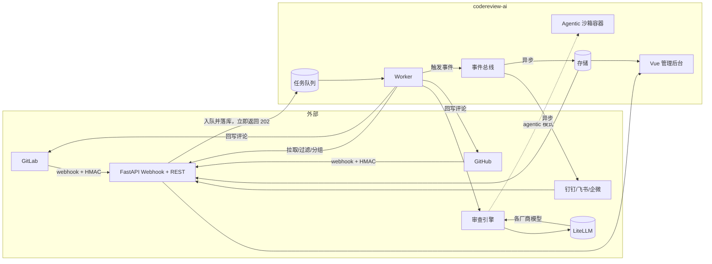
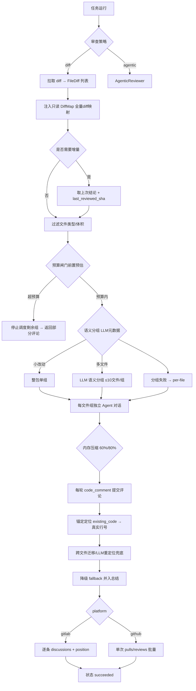
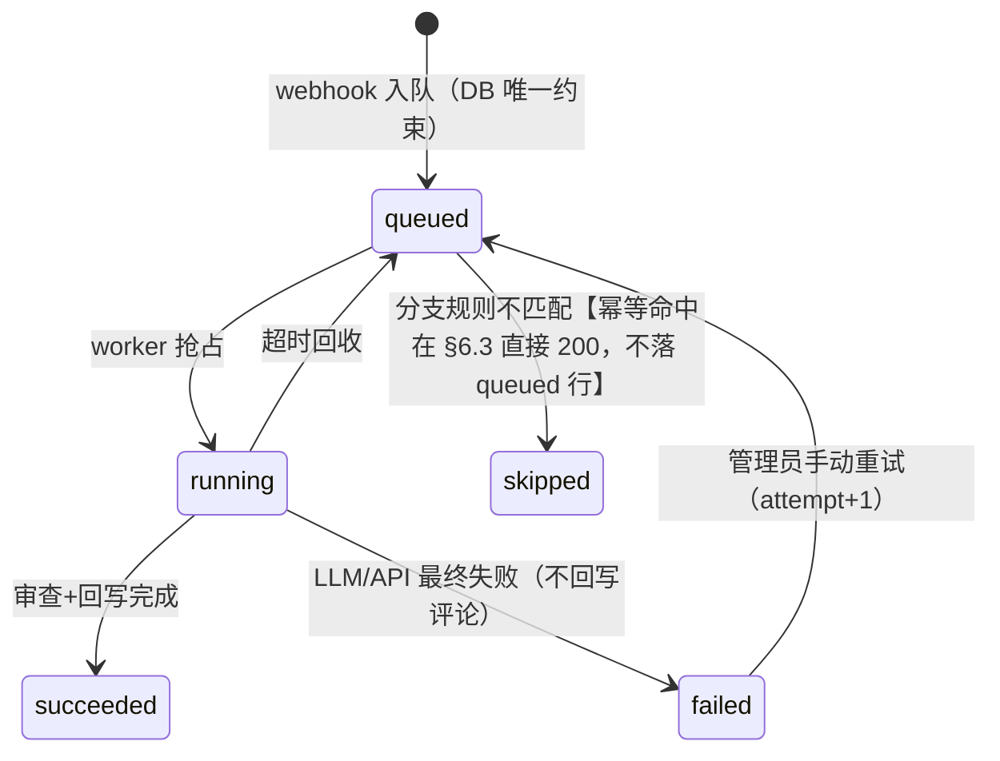
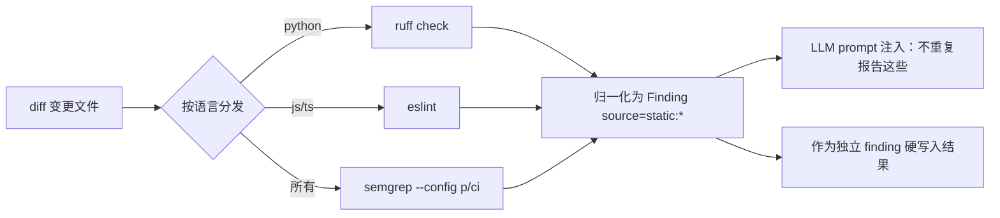
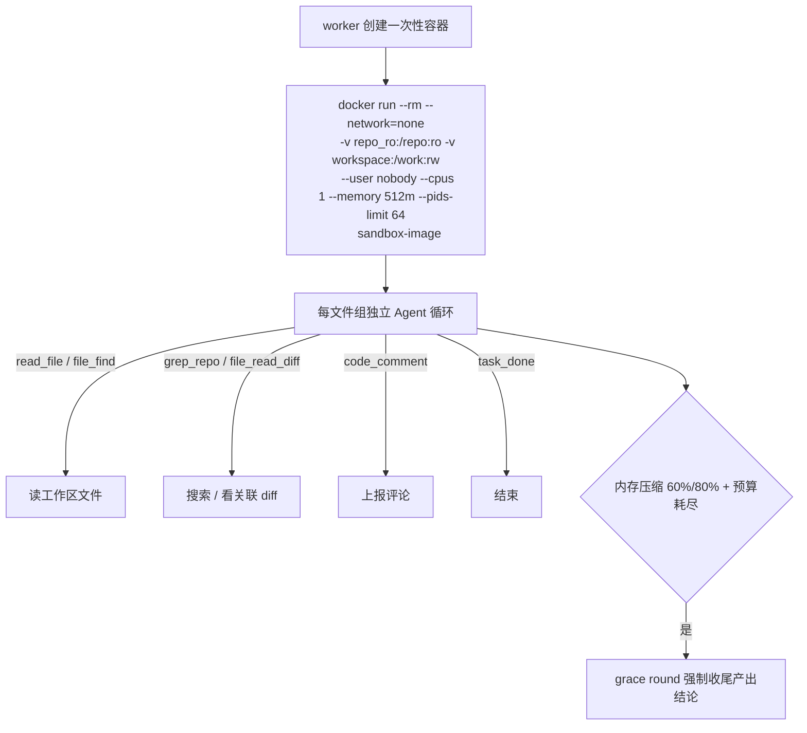

# codereview-ai 详细设计文档

> 配套：需求见 [`PRD.md`](PRD.md)，可复用素材见 [`reference/`](../reference/)。
> 本文给出 v0.1（含 Stretch）的实现设计。所有技术选型均已对照旧项目踩过的坑（`reference/antipatterns.md`）。

---

## 1. 架构总览



**纵向贯穿**：从 webhook 到最终回写，全程携带同一个 `trace_id`（`X-Trace-Id` / 日志字段），
一次审查的完整链路可一键检索。

---

## 2. 技术栈

| 层 | 选型 | 理由 / 备注 |
|---|---|---|
| Web 框架 | **FastAPI** | 原生 async，webhook 场景天然合适；自动 OpenAPI 文档 |
| 前端 | **Vue 3 + Vite + TypeScript** | Composable 架构，Pinia 状态，Vue Router |
| UI 组件 | Element Plus | 成熟的中后台组件库 |
| 图表 | ECharts | 统计看板的主力 |
| Python HTTP | **httpx**（async） | 单一出口，统一 timeout 策略 |
| ORM / 迁移 | **SQLAlchemy 2.0 + Alembic** | 异步 session；Alembic 做版本化迁移 |
| 存储 | SQLite(WAL) / PostgreSQL | 双档切换，见 §8 |
| 队列 | 抽象接口 + asyncio / **arq** | 见 §9 |
| LLM 网关 | **litellm** | 统一多厂商 + 重试 + 成本统计 + JSON mode |
| 静态分析 | ruff / eslint / semgrep | 见 §11 |
| Agentic 沙箱 | 一次性容器（docker / podman rootless） | 见 §12 |
| 校验 | pydantic v2 | 入参 + 输出 schema |
| 包管理 | uv + pyproject.toml | 运行时/开发依赖分离，lock 文件 |
| 质检 | ruff / mypy / pytest / pre-commit | CI 门禁 |
| 构建 | Docker（多阶段）+ docker-compose | 见 §16 |

---

## 3. 目录结构（Monorepo）

```
codereview-ai/
├── pyproject.toml                    # 后端
├── package.json                      # 前端
├── docker-compose.yml                # 一键部署
├── Dockerfile
├── src/
│   └── codereview_ai/
│       ├── main.py                   # FastAPI 入口，挂载路由
│       ├── config.py                 # pydantic-settings，集中配置 + 启动校验
│       ├── logging.py                # 结构化日志 + 脱敏过滤器 + trace_id 上下文
│       ├── ops/
│       │   ├── health.py             # /health /ready /metrics
│       │   └── tracing.py            # trace_id 中间件
│       ├── api/
│       │   ├── webhook.py            # /review/webhook 入口 + 签名校验 + 分流
│       │   ├── deps.py               # 依赖注入（DB session 等）
│       │   └── routes/
│       │       ├── auth.py           # 登录 / 刷新
│       │       ├── reviews.py        # 审查记录 + 详情
│       │       ├── projects.py       # 项目配置 CRUD
│       │       ├── models.py         # 模型配置 + 连通性测试
│       │       ├── notifiers.py      # IM 配置
│       │       ├── stats.py          # 统计看板聚合
│       │       ├── tasks.py          # 任务监控 / 重试
│       │       └── settings.py       # 系统级设置
│       ├── domain/
│       │   ├── models.py             # 中立领域模型：PullRequest, Push, FileDiff, Finding
│       │   └── events.py             # 事件定义（审查完成等）
│       ├── storage/
│       │   ├── base.py               # 存储接口（Repository 抽象）
│       │   ├── sqlalchemy/           # models.py / repositories.py
│       │   └── db.py                 # engine / session / 双档切换
│       ├── queue/
│       │   ├── base.py               # TaskQueue 抽象 + 任务状态机
│       │   └── arq/ / asyncio/       # 两套实现
│       ├── forges/
│       │   ├── base.py               # ForgeAdapter 抽象基类 + 领域模型转换
│       │   ├── gitlab.py
│       │   ├── github.py
│       │   └── _registry.py          # 按 webhook 识别 forge
│       ├── review/
│       │   ├── pipeline.py           # 审查编排（diff / 增量 / 分组 / 预算闸门）
│       │   ├── diffparse.py          # unified diff 解析 → hunks → 可评论行集合
│       │   ├── location.py           # 锚定定位：existing_code → 真实行号（diff_anchor.py）
│       │   ├── grouping.py           # LLM 语义分组 + 降级（OCR grouping.go）
│       │   ├── llmloop.py            # Agent 会话循环 + 内存压缩（60%/80%）+ grace round
│       │   ├── budget.py             # 成本预估 + 前置预算闸门
│       │   ├── static_analysis.py    # ruff/eslint/semgrep 调用
│       │   ├── llm_gateway.py        # LiteLLM 薄封装 + 结构化输出 + 成本
│       │   ├── reviewer.py           # diff 审查主逻辑
│       │   ├── agentic.py            # 探索循环（可插拔，stretch）
│       │   └── display/
│       │       ├── result_writer.py  # 行级评论 + 总结评论的组装
│       │       └── markdown_lark.py  # markdown → 飞书 lark_md 方言
│       ├── notifiers/
│       │   ├── base.py               # Notifier 抽象（见 reference/im_payloads.md）
│       │   ├── dingtalk.py
│       │   ├── feishu.py
│       │   ├── wecom.py
│       │   └── dispatcher.py         # 项目路由 + @阈值 + 重试
│       └── report/
│           └── periodic.py           # 日报（stretch）
├── conf/
│   ├── prompt_templates.yml          # 见 reference/prompt_templates.yml
│   └── model_catalog.yml             # 常用模型 + max_context 默认表
├── frontend/
│   ├── src/
│   │   ├── api/                      # 后端请求封装
│   │   ├── stores/                   # Pinia
│   │   ├── router/
│   │   ├── layouts/
│   │   └── views/
│   │       ├── login/
│   │       ├── dashboard/            # 统计看板
│   │       ├── reviews/              # 审查记录 + 详情
│   │       ├── projects/
│   │       ├── models/
│   │       ├── notifiers/
│   │       └── tasks/
├── tests/
│   ├── unit/                         # 纯函数：diffparse / location / grouping / tokens / 配置
│   ├── integration/                  # 依赖真实 DB + 内存队列
│   ├── e2e/                          # 用 testcontainer 起真实 GitLab
│   └── fixtures/                     # 各平台 webhook payload 快照
└── reference/                        # 从旧项目提取的可复用素材
```

---

## 4. 核心领域模型（中立、平台无关）

> 这是旧项目最大的败笔——三个平台各一份 copy-paste handler。
> 新项目定义中立模型，`ForgeAdapter` 负责双向转换。

```python
# src/codereview_ai/domain/models.py
"""平台无关的中立领域模型。所有平台适配器都输出/消费这些模型。"""

class ChangeType(str, Enum):
    NEW_FILE = "new"          # 新增文件（diff 整文件是 +）
    DELETED_FILE = "deleted"
    RENAMED_FILE = "renamed"
    MODIFIED = "modified"

@dataclass(frozen=True)
class FileDiff:
    old_path: str
    new_path: str
    diff: str                 # 该文件的 unified diff 文本
    additions: int
    deletions: int
    change_type: ChangeType
    # 新文件全文，给 `review/location.py` 的"全文兜底 / 跨文件迁移"用（§7.1）；
    # 定位场景可能为空，见 §7.1 的获取方式
    new_file_content: str = ""

@dataclass(frozen=True)
class PullRequest:
    provider: str             # "gitlab" | "github" | ...
    repo_id: str              # 平台内项目唯一 id（gitlab=project_id, github=owner/name）
    repo_full_name: str       # 展示用 "owner/name"
    web_url: str              # MR/PR 页面 URL
    pr_number: int
    title: str
    source_branch: str
    target_branch: str
    head_sha: str             # 最新 commit sha —— 幂等键之一
    base_sha: str
    diff_refs: dict | None    # gitlab 专用：base/head/start sha，构造 position 必填
    author: str
    is_draft: bool

@dataclass(frozen=True)
class PushEvent:
    provider: str
    repo_id: str
    repo_full_name: str
    branch: str
    before: str               # 全 0 = 新分支（用单 commit diff 兜底）；after 全 0 = 删分支
    after: str
    commits: list[CommitInfo]
    # 消费入口见 §7.7：默认关闭 LLM 审查；差量三分支；幂等键 (repo, branch, after)

@dataclass(frozen=True)
class CommitInfo:
    sha: str
    message: str
    author_name: str
    timestamp: datetime

# ---------- 审查结论 ----------

# 复用 OCR 的 category/severity 枚举（internal/model/review.go），
# 归一化后非法值降级到 other/low，而非整个 finding 失败。
class Category(str, Enum):
    BUG="bug"; SECURITY="security"; PERFORMANCE="performance"
    MAINTAINABILITY="maintainability"; TEST="test"; STYLE="style"
    DOCUMENTATION="documentation"; OTHER="other"

class Severity(str, Enum):
    CRITICAL="critical"; HIGH="high"; MEDIUM="medium"; LOW="low"

@dataclass
class Finding:
    # ── 取自 LLM（LlmComment 对齐）──
    content: str              # 问题正文（markdown：问题/影响/建议）
    category: Category
    severity: Severity
    existing_code: str        # LLM 粘贴它指代的原代码片段 —— 定位锚点，替代行号
    suggestion_code: str | None   # 可采用的替换代码（optional）
    file: str                 # 相对仓库根
    thinking: str | None      # LLM 内部推理，仅审计用，不回写
    # ── 由工程锚定/校验填充，LLM 不产出 ──
    line: int | None          # None = 无法定位，并入总结评论
    source: str = "llm"       # "llm" | "static:<tool>"

@dataclass
class ReviewScores:
    correctness: int; security: int; practices: int; performance: int
    commit_quality: int; total: int

@dataclass
class ReviewResult:
    summary: str
    scores: ReviewScores
    findings: list[Finding]
    skipped_files: list[str]
    raw_llm_json: dict         # 保留原始输出用于审计
```

**为什么 head_sha 而不是 last_commit_id**：GitHub 的 PR 用 `head.sha`，GitLab 用 `last_commit.id`，
但 push 事件没有这两个字段——统一归一到 `head_sha` 语义，由适配器各自映射。

---

## 5. 数据库设计

```mermaid
erDiagram
    PROJECT ||--o{ REVIEW_TASK : ""
    REVIEW_TASK ||--o{ REVIEW_FINDING : ""
    REVIEW_TASK }o--|| MODEL_CONFIG : ""
    PROJECT {
        int id PK
        string provider
        string repo_id UK
        string repo_full_name UK
        string web_url
        string branch_rule
        string file_extensions
        string review_strategy
        string prompt_suffix
        int score_threshold
        string notifier_routing
        bool enabled
        datetime created_at
    }
    REVIEW_TASK {
        int id PK
        string provider
        string repo_id
        int pr_number        "NULL for push 轨（§7.7）"
        string event_type     "mr | push"
        string branch         "源分支（MR 轨）或被 push 的分支（push 轨）"
        string head_sha
        string base_sha
        string state  "queued|running|succeeded|failed|skipped"
        int attempt
        datetime queued_at
        datetime started_at
        datetime finished_at
        string error
        string trace_id
        int model_config_id
        bool writeback_failed      "见 §9.2：有 findings 但回写失败时标记，供重试"
        json model_snapshot        "审查时刻的模型/规则快照，供审计（§9.1 可观测）"
        text diff_snapshot
        text summary_md
        int score_total
        json issues
    }
    REVIEW_FINDING {
        int id PK
        int task_id FK
        string fingerprint         "身份：hash(file + body.lower())，跨轮去重键（§7.3/§13.3）"
        string severity
        string category
        string file
        int old_line
        int new_line
        text existing_code         "锚定片段，供定位 walker 反向映射真实行号（§7.1）"
        string title
        text detail
        text suggestion
        string source
        string status              "active|resolved|waived，生命周期状态机（§7.3）"
        datetime first_seen
        datetime last_seen
        int reopened_count
    }
    PROJECT_RULE {
        int id PK
        int project_id FK
        string path_glob          "首个匹配者胜"
        string rule_text          "追加到 system prompt 的风险点/风格约束"
        json system_merge         "合并到系统规则的方式"
        bool enabled
        int priority
    }
    MODEL_CONFIG {
        int id PK
        string name
        string provider
        string model
        string api_key_encrypted   "Fernet 加密存储（§16）"
        string base_url
        float temperature
        int max_tokens
        json capabilities         "是否支持 json_object / tool_calls / streaming（§7.4/§7.2）"
        int priority
    }
    MODEL_USAGE {                 "-- 每轮 LLM 请求一条，成本归因与审计（§9.1/§10）"
        int id PK
        int task_id FK
        int model_config_id FK
        string phase              "plan|review|reduce|summary|repair|relocate|...（审查 pipeline 各阶段，见 §7）"
        string model
        int prompt_tokens
        int completion_tokens
        int total_tokens
        string status
        float cost
        datetime ts
    }
    NOTIFIER_CONFIG {             "-- 推送渠道 + 项目路由（F4/§15）"
        int id PK
        string channel            "dingtalk|feishu|wecom"
        bool enabled
        string webhook_encrypted
        string secret_encrypted
        int project_id            "NULL=全局默认；非空=项目级路由覆盖"
        int at_threshold          "评分低于阈值 @ 提交者"
    }
```

要点：

- **幂等约束**：MR 轨 `UNIQUE(provider, repo_id, pr_number, head_sha)`；push 轨（§7.7）
  `UNIQUE(provider, repo_id, event_type, branch, head_sha)`（`head_sha`=after）。两轨共用 `event_type` 区分。
  `head_sha` 变了 = 一次新审查；`head_sha` 相同 = 直接跳过。**入队即插入 `queued` 行**，
  靠唯一约束抢占，而不是先查后写（消除旧项目的 TOCTOU 竞态）。
  > ⚠️ **实现要点**：同一张 `review_task` 表上两个约束列集不同，**不能用表级 `UNIQUE`**——必须用
  > **部分唯一索引**（`WHERE event_type=...`），否则两轨会互相干扰（MR 轨 `pr_number` 非空、push 轨
  > 为 NULL，直接建 `UNIQUE(provider,repo_id,pr_number,head_sha)` 会被 `pr_number` 的唯一性误伤）。
  > ```sql
  > CREATE UNIQUE INDEX uq_review_mr   ON review_task(provider, repo_id, pr_number, head_sha)
  >         WHERE event_type='mr';
  > CREATE UNIQUE INDEX uq_review_push ON review_task(provider, repo_id, event_type, branch, head_sha)
  >         WHERE event_type='push';
  > ```
  > SQLite 与 PostgreSQL **都支持部分索引**；若某平台方言不支持，则放弃 DB 唯一约束，退回到
  > "入队前用 `SELECT ... WHERE` 判存在 + 事务内抢 `queued` 行"（性能可接受，但回到先查后写，
  > 需用 `FOR UPDATE`/行级锁防并发）。Alembic 迁移里务必为这两条索引建 `op.create_index`，别漏。
- **任务状态机**（见 §9）：`queued → running → succeeded | failed | skipped(已存在)`
  `running` 超时被回收回 `queued`（堆积隔离）。
- **任务侧模型 task 未拆**（MVP 够用）；**finding 拆表**是为了看板的类别统计、
  未来按 file/line 定位，以及 **foundation 生命周期状态机**（§7.3：`status`/`first_seen`/
  `last_seen`/`reopened_count` 支撑跨轮增量去重与 RESOLVED 保守门）。
- `MODEL_USAGE` 每轮 LLM 请求落一行，是成本归因（§10）与 review 事件流（F7.6）的数据底座。
- `NOTIFIER_CONFIG` 支撑项目级推送路由（F4.2）：`project_id` NULL 为全局默认，非空覆盖。
- **加密落库**：`MODEL_CONFIG.api_key_encrypted` / `NOTIFIER_CONFIG.webhook_encrypted`/
  `secret_encrypted` 均为 Fernet 密文（§16）。
- **key 复用不做非正规化**：project + task + finding 都各自带 `provider/repo_id` 的冗余拷贝，
  换取审查记录查询不需要 join project。数据量级小（十万行/年），冗余可接受。
- **外部头字段留观**：`base_sha`/`diff_snapshot` 一旦需要可分析"同 base 的多次 head 审查对比"（增量审查的基础）。
- 时间统一 `TIMESTAMPTZ`（UTC 存、展示端按 TZ 转）。

---

## 6. Webhook 接入与安全

### 6.1 签名校验（P0，核心安全项）

所有校验都针对**原始 request body bytes**，不能对 `request.json()` 再序列化。

```python
# src/codereview_ai/api/webhook.py（关键逻辑）
from fastapi import APIRouter, Request

WEBHOOK_SECRET = settings.webhook_secret  # 只读全局 env，不读 DB 项目配置（冷启动解耦，见下方分层边界）

def verify_hmac(provider: str, secret: str, body: bytes, headers: Mapping[str, str]) -> bool:
    if provider == "github":
        expected = "sha256=" + hmac.new(secret.encode(), body, hashlib.sha256).hexdigest()
        given = headers.get("X-Hub-Signature-256", "")
        return hmac.compare_digest(expected, given)
    if provider == "gitlab":
        return hmac.compare_digest(headers.get("X-Gitlab-Token", ""), secret)
    if provider == "gitea":
        expected = hmac.new(secret.encode(), body, hashlib.sha256).hexdigest()
        return hmac.compare_digest(headers.get("X-Gitea-Signature", ""), expected)
    # gitee: HMAC-SHA256(secret, f"{timestamp}\n{secret}") base64
    raise NotImplementedError

async def review_webhook(request: Request):
    body = await request.body()                       # 原始 bytes，校验用
    raw_json = orjson.loads(body)                     # 只 parse 一次
    provider = detect_forge(request.headers)          # 注意 Gitea 优先（见 reference）
    secret = settings.webhook_secret
    if not verify_hmac(provider, secret, body, request.headers):
        raise HTTPException(401, "invalid signature")   # 不透露失败原因
    ...
```

- `WEBHOOK_SECRET` **全局唯一**，与各平台的 API token 完全分离（两个配置项）。
- 校验失败 401，不产生任何任务。
- 一个属主 secret 的缺点：泄漏影响所有项目。v0.1 可接受；v0.2 支持项目级独立 secret。
- **注意**：GitHub 的 HMAC 基于 `X-Hub-Signature-256`，Gitea 基于 `X-Gitea-Signature`，
  两者对同一 body 的算法不同（前缀 vs 裸 hex）；**GitLab 不是 HMAC**，是明文
  `X-Gitlab-Token` 直接比对（见 `reference/platform_payload_map.md`）。所以对外统一说
  "签名/Token 校验"，README 不再写死 "HMAC 签名校验"。三者一律 `hmac.compare_digest` 比对。
- **分层边界**：v0.1 的 webhook 签名**只走全局 env `CR_WEBHOOK_SECRET`**，不读 §16 的
  每仓库 DB 配置；§16 的分层（全局 / DB / 项目覆盖）只服务**后台 REST 的 API token 注入**，
  两者互不相干，避免"webhook 要查 DB 才知道用哪个 secret"的冷启动耦合（webhook 必须在 DB 没起来时也能验签）。

### 6.2 分流与事件过滤

```python
def detect_forge(headers):
    if headers.get("X-Gitea-Event"):   return "gitea"     # 必须先于 GitHub
    if headers.get("X-GitHub-Event"):  return "github"
    return "gitlab"                                     # 无对应 header，看 body

HANDLED_ACTIONS = {"opened", "reopened", "synchronize", "update"}
```

- 只处理 MR/PR 的 open/synchronize 系列 action；close/merged 直接忽略（200 但不入队）。
- **push 事件**：独立轨道，见 §7.7 —— 默认关闭 LLM 审查，事件幂等落库；`after` 全 0（删分支）忽略。
- 分支规则（F1.7）：项目配置 `branch_rule` 正则匹配 `target_branch`，不匹配 → `skipped`。

### 6.3 入队协议

```
POST /review/webhook
  → 签名校验
  → 幂等约束插入 queued（冲突=唯一约束报错 → 返回 200 已存在）【幂等命中返回 200，**不产生 queued 行、不需要 skipped 状态**；"skipped"只保留给分支规则不匹配，见 §9.2】
  → enqueue_task(task_id)        # 返回 202
  → 立即返回 {"status":"accepted","task_id":..., "trace_id":...}
```

**不校验授权**：webhook 是推送事件，鉴权靠签名。后台 REST 才是需要 JWT 的。
（旧项目相反：webhook 无鉴权、后台却用自旋的 HMAC cookie——两个都错。）

---

## 7. 审查引擎（review pipeline）



### 7.1 diff 拉取与解析

- `ForgeAdapter.fetch_pr(pull_request) -> (base_sha, head_sha, diff_refs)`；
  `fetch_files(pr) -> list[FileDiff]`。
- changes API 可能延迟（返回空数组）：`asyncio.sleep` + 指数退避重试 3 次（旧项目用同步 sleep，会阻塞 worker）。
- `diffparse.py` 解析 unified diff：按 hunk 拆出 `旧行号↔新行号` 映射，
  得到**可评论行集合**（新增行 = hunk 内的新行号；上下文行 = 新行号；删除行 = 旧行号）。
  这是行级评论正确性的地基。
- **`FileDiff` 必须尽量带 `new_file_content`（新文件全文）**：`reference/diff_anchor.py` 的"全文兜底"
  与"跨文件迁移"两条定位路径都读 `d.new_file_content`，缺了就一直空转。
  两个来源二选一，且**只对"hunk 内未命中"的 finding 按需补拉，别为每个文件都拉全文**：
  - 平台取整文件：GitLab `GET /projects/{id}/repository/files/{path}/raw?ref=head_sha`
    （changes API 不返全文）；GitHub files API 每文件的 `contents_url`/`raw_url` 拉原文。
  - 或本地重建：拿不到原文时用 `reconstruct_base_file(head, patch)` 反推（`reference/pr_agent_notes.md` §9）。
  全文匹配是 O(文件行数 × 命中尝试)，命中即短路；对超大文件可先做行数上限截钳。

### 7.2 文件过滤与 LLM 语义分组（替代初稿的机械分片）

- 过滤：`file_extensions`（项目级）+ 忽略文件（`node_modules/`、`dist/`、lock 文件、图片等）+ 单文件体积/行数上限（默认 600 行或 20KB）。`skipped_files` 全程传递，写入总结评论与报告。
- **注入只读 DiffMap**：所有解析出的 diff（**含被过滤掉的**）做成只读映射，供 LLM 用 `file_read_diff` 按需查询关联文件——避免"被滤掉的调用方让实现看不到上下文"。
- **语义分组**（`review/grouping.py`，1:1 复用 OCR `grouping.go` 决策链）：
  1. 分组 LLM 只喂**文件元数据** `STATUS path (+N/-M)`，不含 diff 内容——便宜且聚焦。
  2. 本地短路：`len ≤ 1` → per-file 单组；`files < 4 且 churn < 200` → **整包单组**（小改动不值得分组）。
  3. `files ≥ 4` → 调 LLM 语义分组，把 `message_en/zh.properties` 这类关联文件并到一组。
  4. LLM 分组失败 → 降级 per-file（每个文件一组）。
  5. 强约束：`max_files_per_group = 10` 切超大组；每组的 token 预算 ≤ 80% MaxTokens，超预算拆成单文件组。
- **每文件组一个独立对话**（key=groupKey），组间并发、组内上下文隔离。**跨组的合并是确定性的**
  （见下 & §7.4）：union all findings → 按内容指纹去重 → 评分分项取**最坏值**。**默认 diff 审查主链
  不调用 reduce LLM**——`conf/prompt_templates.yml` 里的 `reduce_review` 模板**不进主链**，
  只留给未来的"whole-file 整仓 / agentic 整仓"模式做认知归并（见模板注释），避免主链多一轮
  非确定性、多一份成本。两套汇总语义（LLM reduce vs 确定性合并）中，**确定性合并是唯一主路径**。

### 7.3 增量审查

```python
reviews = repo.last_ok_review(project_id, pr_number)     # 上次 succeeded 且 head 是本次 base 链上的
if reviews:
    extra = dict(
        is_incremental=True,
        last_reviewed_sha=last.head_sha,
        previous_findings=last.finding_titles_and_files,   # 只带标题+文件+行号，不带全文，省 token
    )
    # diff 只拉 last.head_sha..head_sha；但行级评论仍需要整体 diff 的行号上下文
```

- LLM prompt 注入"只审增量，不重复上次问题 + 上次问题列表供参考"。
- **实现要点**：增量 diff 用作审查内容，行号校验仍按**整体** diff 的可评论行集合。
  两套 diffparse：一套整体（算行号），一套增量（喂给 LLM）。
- **base 失效回退**：force-push / rebase / merge-main 会让 `last.head_sha` 不再落在本次 PR 的
  可比较 diff 链上（平台 compare 失败或空）。此时**回退为全量审查**，且**不得对本次 diff 外的
  finding 触发 RESOLVED**——保守门保持 (§7.3 状态机），棘轮宁可多改一次也不误判已解决。
- **指纹一致性**：这里的状态机用的是**身份指纹**；发出前的去重判断（body_fp / code_fp）见 §13.3，
  两者分别落 `REVIEW_FINDING.fingerprint` 与去重库，别混用。
- **finding 生命周期状态机**（F2.20，PR-Agent `review_finding_state.py`，见 `reference/pr_agent_notes.md` §3）：
  finding 身份用 `hash(file + body.lower())` 内容指纹（非行号——行号会漂，内容不会）。
  跨轮对账：新 finding → ACTIVE；上次在、这次不在 → **仅当"非增量完整审查 且 head_sha 变化"才转 RESOLVED**
  （保守门，防部分审查误判已解决）；追踪 `first_seen/last_seen/reopened_count`。
  落 `REVIEW_FINDING` 表，不塞到 PR 评论里（PR-Agent 因无 DB 才把状态藏评论隐藏标记，我们不需要）。

### 7.4 结构化输出与容错

- **主路径不做 JSON-mode 假设**（国产模型 / ollama 常不原生支持，见 §20 风险）：
  **默认走「schema-constrained prompt + 输出修复链」**——prompt 用 `reference/prompt_templates.yml`
  的严格 schema，LLM 尽力出 JSON，再走 `pydantic ReviewResult` 校验 + F2.19 修复链
  （去围栏/去控制符/抹字符重试/截到末合法元素）。
- `response_format={"type": "json_object"}`（OpenAI 系）只作为 **provider 明确支持时的加速项**
  （读 `MODEL_CONFIG.capabilities.json_object`），不支持则回落主路径。
- `category`/`severity` 归一化到枚举，非法值降级到 `other`/`low`，而非整个 finding 失败。
- 失败 → 附"仅此一次修复"重试；仍失败 → 任务 `failed`，**不回写评论**。
- 强制字段 `skipped_files`，杜绝静默截断。
- **LLM 层错误一律抛 `LLMError`**，由 pipeline 捕获决定降级/失败，绝不当作正常结果返回。
- **确定性修复**（可选加固，OCR `comment_args_repair.go`）：LLM 偶发把 `comments` 序列化成
  string 时，字符扫描修复未转义引号/控制符，并校验条数/截断迹象，不过则保留 parse error。
- **输出修复链**（升级 PROD 版，PR-Agent `algo/utils.py`，见 `reference/pr_agent_notes.md` §1）：
  解析失败按层修复——剥代码围栏 → 去控制符 → 多行未加引号值转块标量 → 抹问题字符重试 →
  JSON 数组截到末个合法元素；纯函数无依赖，放 `llm_gateway` 里结构化校验前。
- **diff 预算三件套**（PR-Agent `pr_processing.py`，见 `reference/pr_agent_notes.md` §2）：
  预留软/硬输出缓冲防中途 OOM；被裁掉的 hunk 的文件名进 prompt（诚实覆盖度脚注）；
  分块 map 后按 **union findings + 分项取最坏值** 合并，不简单平均总分。

### 7.5 锚定定位（existing_code 行号守卫，头号风险）

**不做**「LLM 拍行号 + 校验」——行号在 LLM 上下文里极不稳定，必然漂移。
改为 **LLM 只贴它看到的代码片段 `existing_code`，系统纯字符串匹配钉出真实行号**。
Python 移植已就绪：`reference/diff_anchor.py` → 落地 `review/location.py`，复刻 OCR `resolver.go` 的
**确定性三步**（hunk 内 / 全文 / 跨文件迁移），输出 `side`/`old_line`/`new_line`/`edit_type`（§13 回写用）；
第 4 步 **LLM 重定位**不在纯函数 anchor 内，是独立于它的 review 层兜底（见下方顺序 4）。

```python
# src/codereview_ai/review/location.py
def resolve_line_numbers(comments: list[Finding], diffs: list[FileDiff]) -> list[Finding]:
    """复刻 ResolveLineNumbers：LLM 给每个 finding 的 existing_code，
    这里统一钉到真实文件行号。仍为 0 行的调用方降级并入总结评论。"""
```

定位四件套（顺序执行，前一步命中即停）：
1. **hunk 内匹配**：existing_code 逐行 normalize（TrimSpace + 剥 `+`/`-` 前缀），
   先新侧后旧侧，只匹配连续非空行序列。
2. **全文兜底**：hunk 没命中，扫整新文件（跳过空行做连续匹配，blank-tolerant）。
3. **跨文件迁移**：片段其实属于声明/实现拆分的另一个文件时，**纯字符串匹配**找唯一命中才
   迁移 path/行号一起改；0/多命中都放弃（样板代码合法出现在多文件，猜不如不猜）。
4. **LLM 重定位**：以上全失败的极端兜底才调模型（给错文件 diff + 要求回代码块）。

分类结果：
- `inline`：行号落在该文件可评论范围内 → 平台直接发行级评论
- `fallback`：行号越界 / 无锚定 → 并入总结评论，但在总结里以子列表保留，不丢信息

**为什么必须这么做**：两个平台都只接受 diff hunk 范围内的行号，
LLM 指出"文件里存在但本次没改"的行会被平台 422 拒绝。宁可多走校验层，
也不要让核心体验时好时坏。

### 7.6 规则引擎（模板化注入，复用 OCR §7）

项目级可配置规则，命中 path 后**模板化注入** review prompt，而不是拼进全局 prompt：

- 数据结构：`SystemRule{default; path_rules:[{pattern, rule}]}`；`path_rule_map` 保留声明顺序，**首个匹配者胜**。
- 匹配：`fnmatch`/`pathlib.match`（**只支持 `*?[]`，不含 `{}` brace 展开**——Python 标准库
  不做 brace，若项目要用 `{a,b}` 需引 `wcmatch`，否则文档写成 `{}` 实际不生效）+ 大小写 lower。
- 规则值 markdown；`merge_system_rule: true` 时输出 `## System-Specific Rules` + `## User-Specific Rules` 两段。
- 存储：项目配置表 `project_rule`（DB，见 §5 ERD），后台 F5.3 可视化编辑——比 OCR 的文件方案更适合本项目的管理后台定位。
- 白名单：仅 `.md/.txt/.markdown` 值、512KB 上限（防 prompt 毒化与体积失控）。

### 7.7 Push 审查（从旧项目继承，默认关闭）

旧项目已经实现 push 事件审查，但**默认关**（`PUSH_REVIEW_ENABLED=0`），且**只产总结评论、不做行级**。
我们继承这条能力链，并补齐旧项目缺的两块：**幂等**、**分支规则收敛**（旧项目 push 无任何分支过滤，
每个分支的每次 push 都审，刷屏严重）。

- **触发与门**：GitLab / GitHub 的 push 事件 → 仅当 ①项目 `review_strategy` 开启 push 审查（项目级，默认关）
  且 ②`branch_rule` 命中（把"只审合入受保护分支"，见旧项目 `target_branch_protected`，落到分支规则）时，
  才真正调 LLM。事件本身始终**幂等落库**，用于审计"谁、什么时候、往哪个分支、推了什么到哪个 sha"。
- **差量三分支**（复用旧项目 `PushHandler.get_push_changes` 已验证的思路，`reference/platform_payload_map.md` §6）：
  - `after` 全 0 → **删除分支**，忽略；
  - `before` 全 0 → **新分支**，用**单 commit diff API** 取首个提交差量（旧项目的兜底分支，`gitlab/webhook_handler.py:318-324`，值得抄）；
  - 其余 → compare API（`from=before&to=after`）。
  三种情况都要设 timeout + 重试，不能照抄旧项目 `time.sleep` 阻塞（antipattern A4 / B）。
- **产物无行级评论**：push 没有 MR 可挂 inline，只产**一条总结评论**，回写到 head commit：
  - GitLab：`POST /projects/{id}/repository/commits/{sha}/comments`，字段 **`note`**；
  - GitHub：`POST /repos/{o}/{r}/commits/{sha}/comments`，字段 **`body`**（`note` vs `body` 方言差异，见 §13.1）。
- **幂等（旧项目缺口，我们补）**：旧项目 push 无任何去重，同一分支连续 push 会重复审、重复追加 notes。
  加 `UNIQUE(provider, repo_id, event_type, branch, head_sha)`（push 轨 `head_sha`=after）抢占，相同跳过；
  区别于 MR 轨的 `UNIQUE(provider, repo_id, pr_number, head_sha)`。
- **与 MR 审查隔离**：push 审查**不**进 finding 指纹状态机的生/消对账（那条链只为 MR 增量设计），
  只做"该分支最近一条 successful 记录"去重。`REVIEW_TASK` 以 `event_type ∈ {mr, push}` 区分两条轨道，
  `pr_number` 在 push 轨为空（允许 NULL）。

---

## 8. 存储层（双档）

### 8.1 抽象

```python
# src/codereview_ai/storage/base.py
class UnitOfWork(ABC): ...
class ReviewRepository(ABC): ...
# 两套实现：storage/sqlalchemy/ 标准实现（P0）
# PostgreSQL / SQLite 只是 engine URL 的差异 + 少量方言开关，不透传到业务层
```

- 业务层只依赖抽象接口，不 import SQLAlchemy 模型。
  这保证测试能用内存版仓储替换。
- **SQLite 特判**：`PRAGMA journal_mode=WAL; PRAGMA busy_timeout=5000; PRAGMA foreign_keys=ON`，
  每个 engine 初始化时执行一次。**修复旧项目 `database is locked` 与 fd 泄漏**
  （旧项目 `with sqlite3.connect()` 只提交不关闭）。

### 8.2 切换方式

`DATABASE_URL=sqlite:///./data/app.db`（默认 simple）或 `postgresql+asyncpg://...`。
- **simple 档**：SQLite + **进程内 asyncio 队列**（单进程自带 worker，用 `asyncio.Queue`）。
- **standard 档**：PostgreSQL + **Redis + arq**（多 worker / 持久化 / 超时重投 / 死信）。

> 队列抽象成 `QueueBackend` 接口（`enqueue`/`claim`/`ack`/`requeue`），
> 两档各一个实现，别把 arq 当 simple 档也硬套（simple 依赖 Redis 就违背了"单容器免外部依赖"的初衷）。

---

## 9. 队列与任务状态机

### 9.1 抽象

```python
# src/codereview_ai/queue/base.py
class TaskQueue(ABC):
    async def enqueue(self, task: TaskMeta) -> None
    # simple: 进程内 asyncio.Queue + worker task
    # standard: arq（Redis），天然支持多 worker、持久化、dead letter
```

- **断言**：队列只搬 `task_id`，不搬 payload。worker 从 DB 取出任务 — 天然幂等、重启不丢。
- **标准档 beeline**：arq 的 `max_jobs`（并发上限）、`job_timeout`、重试/死信队列
  都满足需求，避免自己写任务调度。
- 重启/崩溃恢复：`running` 状态且 `started_at` 早于现在-X 分钟的任务被回收重投。

### 9.2 状态机



- `succeeded` 只能由"审查成功 **且** 回写成功"达成；回写失败但审查已落库 → 单独 `writeback_failed` 字段 + 重试。
  （旧项目把"审查成功"和"推送成功"混成一个状态，导致推送失败也显示审查成功、且无法重试推送。）

---

## 10. LLM 网关（LiteLLM 薄封装）

```python
# src/codereview_ai/review/llm_gateway.py
import litellm

class LLMGateway:
    def __init__(self, cfg: ModelConfig):
        self.model = cfg.composite_name          # e.g. "openai/gpt-4o-mini", "deepseek/deepseek-chat"
        self.max_context = cfg.max_context or CATALOG.get(cfg.composite_name, 128_000)
        self._client() if cfg.api_key ...        # httpx 复用 / 超时策略

    async def complete(self, *, messages, json_schema=None) -> CompleteResult:
        kwargs = dict(model=self.model, messages=messages,
                      timeout=self.http_timeout, # 统一 timeout，禁止 None
                      metadata={"trace_id": TRACE_ID.get()})
        if json_schema:
            kwargs["response_format"] = {"type": "json_object"}
        for attempt in range(3):                 # 指数退避 1s/4s
            try:
                resp = await litellm.acompletion(**kwargs)
                usage = resp.usage  # 记入 usage 表，用于看板成本归因
                return CompleteResult(resp, usage)
            except litellm.RateLimitError:
                backoff(); continue
            except litellm.Timeout as e:
                raise LLMError(e)                # 抛异常，绝不返回错误字符串
            except Exception as e:
                if "401" in str(e): raise LLMError("auth failed")  # 不再伪装成 review
```

设计约束：
- **错误抛异常**（`LLMError`），调用方只面对"成功或抛错"二选一。
- **结构化输出 + schema 校验**在 gateway 统一做，业务层拿到的是干净的 `ReviewResult`。
- 成本/用量按 per-model+task 落库 `model_usage` 表 → 看板成本归因。
  > **成本决策（C3）**：不加"每 MR token 上限"这类硬性 NFR——"贵不贵"交给运维侧看板（§15）判断，
  > 系统的成本准绳**只有预算闸门 F2.11**（调度前预跑，超预算停止剩余组返回部分评论）+ §20.6 的语义分组效益 benchmark。
  > 这是有意的取舍：成本是运营/财务视角，硬阈值容易误伤大仓库的合法变更，不如守住"超长 diff 不失控"这一个工程杠杆。
- **max_context 预算**：模型 catalog + 项目设置，审查前用 `tokens.py` 粗算
  prompt 是否符合模型上下文，不符就交给**语义分组**拆组 + **内存压缩**兜底（见 §7.2 / §12.3）。

---

## 11. 静态分析融合（stretch）



- 只对**变更涉及的文件**跑分析（全仓跑太慢）。
- 归一化：`(severity, file, line, title/unified)` → `Finding(source="static:ruff")`。
- LLM 侧：`static_findings` 注入 prompt（`reference/prompt_templates.yml` diff_review.system）。
- 收益：确定性问题交给工具（零 token、零幻觉），LLM 专注语义与设计。
- 顺序：**静态分析先跑**，失败不影响审查主流程（warning 级降级）。

---

## 12. Agentic 审查沙箱（stretch / 安全重中之重）

**设计原则：不给 LLM 机会接触 shell，是唯一能真正防住 prompt injection 的办法。**



### 12.1 工具集（只提供结构化工具，不提供 shell）

工具集 1:1 复用 OCR（`reference/ocr_notes.md` §6，改名为自家命名）：

| 工具 | 入参 | 返回 | 限制 |
|---|---|---|---|
| `code_comment` | `comments:[{content, existing_code, suggestion_code, category, severity, path, thinking}]` | "Successfully commented." | **LLM 唯一上报评论的通道**；缺 path 回退 groupKey；category/severity 归一化 |
| `grep_repo` | `search_text, case_sensitive, file_patterns:[]` | 超 100 命中截断提示 | 拒绝 `..` |
| `read_file` | `file_path, start_line, end_line` | 行号\|内容；IS_TRUNCATED | 每文件 ≤ 500 行 |
| `file_read_diff` | `path_array:[]` | `==== FILE: path ====\n<diff>` | 只返回已解析 diff（DiffMap 只读） |
| `file_find` | `query_name, case_sensitive` | 路径列表 / not found | ≤100 |
| `task_done` | `state: DONE\|FAILED` | 终止循环 | FAILED → Fail |

**没有 `run_command`（壳命令）。** 旧项目提供壳命令是沙箱被绕过的根因（`reference/antipatterns.md` A2）。
这些结构化只读工具覆盖 90%+ 的探索需求，攻击面从"任意代码执行"降到"只读文件 + 发评论"。

### 12.2 隔离清单

- 仓库**只读**挂载（`/repo:ro`），写目录是独立空 workspace
- `--network=none`：即使被攻破也无法外联
- 非 root + `--pids-limit` + cpus/memory 限额
- 容器镜像预装 `rg`；无需 python 依赖
- agent 会话有独立 trace_id，结束后容器 `docker rm -f` 清理

### 12.3 会话循环加固（复用 OCR llmloop）

- **内存压缩**（`llmloop.py`）：会话 token 超 **60% MaxTokens** 触发异步后台压缩、超 **80%** 立即同步压缩。
  三区划分：frozen（system+首条 user）恒保留 → compress zone 交给 LLM 摘成 `<previous_review_summary>`
  追加进第 2 条 user → active zone（尾部完整 rounds）保留。**压缩失败不截断**——宁超限不回退丢证据。
  每个文件组独立压缩（per-conversation）。
- **grace round**：工具预算耗尽后给终轮**只允许 `code_comment`/`task_done`** 补交结论，防止"该收尾却还在乱试工具"。
- **空轮检测**：连续空轮 → 追加 user 消息"无有效输出，请给结论或调用工具"，再超则按 `main_loop_stop` 收束，不原样重发白烧 token。
- **`max_iterations`/`max_time`/`max_prompt_tokens`** 三者任一触顶 → 同样走 grace round 强制收尾，而不是抛异常重跑（旧项目 runner 白烧预算，见 antipattern B8）。

### 12.4 预算闸门与降级

- **前置成本预估**（`budget.py`，复刻 OCR `estimate.go`）：调度每个文件组前算
  `projected = TotalTokensUsed + Σ estimate(group.diffs)`，超 `MaxTokensBudget` 就**停止调度全部剩余组**
  （在飞组可跑完），返回部分评论而不是丢弃全部；预跑只做量级警告，真实用量事后按 API usage 上报。
- 任意阶段失败 → **整条降级为 diff 审查**，保证至少有一条普通 review 落回。
- 默认关闭（`review_strategy` 项目级默认 `diff`），显式开启。

---

## 13. 结果回写与行级评论

### 13.1 GitLab（逐条 discussions + position）

```python
diff_refs = pr.diff_refs   # 从 GET /merge_requests/{iid} 的 diff_refs 取，不能自己拼
for f in out.inline:
    body = render_markdown(f)                      # 标题 + detail + suggestion codefence
    # edit_type/old_line/new_line 由同一定位 walker 算出（§7.1）：删行 old_line，其余 new_line
    if f.edit_type == "deleted":
        new_line, old_line = None, f.old_line
    else:
        new_line, old_line = f.new_line, None
    position = dict(position_type="text",
                    base_sha=diff_refs["base_sha"], head_sha=diff_refs["head_sha"],
                    start_sha=diff_refs["start_sha"],
                    old_path=f.file, new_path=f.file,
                    new_line=new_line, old_line=old_line)
    await forge.post_with_retry(f"/notes?position=...")     # 限速 2/s，失败入 fallback
```

### 13.2 GitHub（单次批量 review + 稳定锚点）

```python
comments = [
    {"path": f.file,
     "line": f.new_line or f.old_line,          # 由定位 walker 产出（§7.1），非 LLM 拍号
     "side": "RIGHT" if f.edit_type != "deleted" else "LEFT",  # 删行只能挂 LEFT+old_line
     "body": body}
    for f in out.inline]
await forge.post_pull_review(pr, dict(
    commit_id=pr.head_sha, event="COMMENT", body=out.summary, comments=comments))
```

一次请求全部提交 → **只产生一封通知邮件**。

- **锚点用 `line`+`side`(+`start_line` 多行 suggestion)，不用会随 commit 漂移的 legacy `position`**。
  PR-Agent 用 `position`（补丁文本内索引）所以只能每次重发靠内容指纹兜底——我们不要这个缺陷（见
  `reference/pr_agent_notes.md` §4 反面教材）。
- **422 拆分重试**：`_verify_code_comments` 先把合法改行拆出，一次重发合法批；非法行逐条转文件级注释
  （PR-Agent `github_provider.py:828` 骨架）。
- **左右侧一致**：`edit_type == "deleted"` 的删行用 `side: LEFT` + `old_line`；新增/修改用 `side: RIGHT` +
  `new_line`。这个 `edit_type / old_line / new_line` 三元组由**同一个定位 walker**（§7.1）算出，
  GitLab 侧（§13.1 的 new_line/old_line）复用同一份——两个平台永不各自拍行号（F3.1）。

### 13.3 共通

- `out.fallback` 作为总结评论里的 `## 未能定位到行的建议` 子段。
- 平台返回非 2xx → finding 依失败类型区分：越界 → 降级 fallback；网络 → 重试；重试仍败 → 标记 push 失败发管理员。
- **重复审查更新**（F3.5）：GitLab 有 API 更新已有 note；GitHub 的 review 是追加式的，改为"保留最新"策略。
- **内容指纹去重（发出前）**：**finding 身份**与**去重判断**是两个指纹，别混为一谈。
  - **身份（identity，F2.20）**：`hash(file + body.lower())`——某一轮产生的一条具体意见，跨轮稳定、行号会漂内容不会。
  - **去重（dedup）**：改另一手。因为同一问题**改动后措辞会变**，单看 body 会误判"新问题"而重复报。
    按 PR-Agent 的 `body_fp OR code_fp`：`body_fp`（body 指纹）命中即判重复；body 变了但
    **代码片段 `code_fp`（existing_code 指纹）没变**，也判重复，并**复用上次的 identity**（`first_seen` 不动、
    `reopened_count` 不变）。只有 body 和 existing_code 都变，才新建 identity。
  - 发 inline 前查本地上次评论库，已见过的跳过，减少无谓 API 调用。是否去重走项目级开关
    `persistent_inline_comments`（默认关，PR-Agent 同款）。见 `reference/pr_agent_notes.md` §3。

---

### 13.4 inline 过滤口径（统合 PRD 与 DESIGN，替代两条规则）

**一个 finding 是否发为行级评论，由单一谓词决定**，同时吃两个输入：定位是否成功、以及严重级是否达到配置门槛。两条旧规则（PRD 的"只发 high/critical"与本章"能定位才发"）**折叠成一条**，不再各说各话：

| 定位结果 | 严重级是否 ≥ `min_inline_severity` | 处理 |
|---|---|---|
| inline（行落在该文件可评论行集合内） | 是 | 行级 inline 评论 |
| inline | 否 | 并入总结「低优先级建议」子段（仍带 `path:line`） |
| fallback（越界 / 无锚定定位失败） | 任意 | 并入总结「未能定位到行的建议」子段（不丢信息） |

- `min_inline_severity` 是**项目级配置**（后台 F5.3），**默认 `high`**，兑现 PRD 风险表的防刷屏意图；需要更高行级曝光度的团队可调低到 `medium`/`low`。PRD 表里那句"只报 high/critical 到 inline"从**硬编码规则**降级为**该配置的默认值**。
- 与 `score_threshold`（P2：评分卡 CI 合并）、`at_threshold`（F4.3：评分过低 @ 提交者）语义区分：它只管**评论落点（inline vs summary）**，不管评分后的动作。
- 降级进 summary 的项**不丢弃已算出的行号**，写成 `@ path:line` 便于人工定位——比纯丢信息强。

```python
SEVERITY_RANK = {"critical":4, "high":3, "medium":2, "low":1}

def classify_for_writeback(f: Finding, min_inline_severity: str) -> Literal["inline", "summary"]:
    if f.line is None or f.line not in commentable_lines(f.file):
        return "summary"                                       # 定位失败/越界 → fallback
    if SEVERITY_RANK[f.severity] < SEVERITY_RANK[min_inline_severity]:
        return "summary"                                       # 严重级不足 → 降级
    return "inline"
```

> 注：该谓词在 `result_writer.py` 组装评论时统一执行；`commentable_lines(file)` 来自 §7.1 的可评论行集合。

---

## 14. 管理后台（Vue 3）

### 14.1 技术要点

- **表单/配置**：以 JSON schema 驱动为佳——后端是 pydantic 模型，直接 `model_json_schema()` 暴露；
  前端用 `Formily`/`FormKit` 渲染，少写一半表单代码。
- **状态**：Pinia；审查列表/任务列表用 `@vueuse` 的 `usePagination` + 服务端分页
  （**禁止全表 SELECT 进前端统计**——旧项目 `ui.py:591` 就是这么卡死的）。
- **图表**：ECharts；统计在后端**聚合**（`GROUP BY` 出结果给前端），前端不拉裸数据再算。

### 14.2 路由

```
/login
/dashboard                         # 统计看板
/reviews?project=&state=&from=&to=  # 审查记录（服务端分页）
/reviews/:id                       # 详情：summary + findings + 平台链接 + trace_id
/projects                          # 项目管理 CRUD
/models                            # 模型配置 + 连通性测试
/notifiers                         # IM 配置 + 推送测试
/tasks                             # 任务监控 + 手动重试
/settings                          # 系统级（webhook secret 为只读展示）
```

### 14.3 鉴权

- 登录：`POST /api/auth/login` → JWT（HS256，`SECRET_KEY` 来自环境变量，**无默认值**，未配置 fail-fast）。
- `api/deps.py` 的 `get_current_user` 依赖解析 Bearer token。
- 前端把 JWT 存 `sessionStorage`（非 localStorage，关闭即失效更安全）。

---

## 15. 可观测性

### 15.1 trace_id 贯穿

```python
# src/codereview_ai/logging.py
TRACE_ID = contextvars.ContextVar("trace_id", default="")
@asynccontextmanager
def trace(prefix: str = ""):
    tid = TRACE_ID.get() or f"{prefix}{uuid4().hex[:12]}"
    token = TRACE_ID.set(tid)
    try: yield tid
    finally: TRACE_ID.reset(token)
```

webhook 入口生成 → 传给队列 → worker 读出并统一设置 → 每一段（LLM 调用、forge 调用、IM 推送）
都在日志里带上。**webhook 响应也返回 trace_id**，用户遇到问题能直接拿它质询。

### 15.2 结构化日志 + 脱敏

- **JSON 结构化**（每条一行的 JSON，非人类排版）。
- `SensitiveFilter(logging.Filter)`：对 `loggable` 消息统一打码
  `.token.`, `.key.`, `.secret`, `.password`, `.Authorization`, URL 里的 `sign=`/`token=`。
- 统一 `logger = logging.getLogger("codereview_ai")`，日志字段含
  `ts level trace_id task_id provider repo pr_node event service`。
- **不记录请求 body / diff 正文**到日志（旧项目 `webhook.py:62` 把整个 payload 打进去）。

### 15.3 端点

- `GET /health`（存活，恒 200）
- `GET /ready`（DB 连通 + 队列连通 + 表结构就绪）
- `GET /metrics`（prometheus_client）：`review_total{state}`、`review_duration_seconds`、
  `webhook_received_total{provider}`、`llm_tokens_total/model`、`queue_depth`、
  `llm_error_total{type}`。

---

## 16. 配置管理

```python
# src/codereview_ai/config.py
class Settings(BaseSettings):
    model_config = SettingsConfigDict(env_prefix="CR_", env_file=".env", extra="ignore")
    secret_key: str                    # 无默认，启动校验
    webhook_secret: str                # 无默认，启动校验
    database_url: str = "sqlite:///./data/app.db"
    queue_backend: Literal["asyncio", "arq"] = "asyncio"
    redis_url: str | None = None
    log_level: str = "INFO"
    openapi_enabled: bool = True
    ...
    @model_validator
    def _fail_fast(self):
        missing = [f for f in ("secret_key","webhook_secret","encryption_key") if not getattr(self, f)]
        if missing:
            raise SystemExit(
                "CR_SECRET_KEY / CR_WEBHOOK_SECRET 未配置：python -c 'import secrets;print(secrets.token_urlsafe(48))' 各生成一个；\n"
                "CR_ENCRYPTION_KEY 未配置：python -c 'from cryptography.fernet import Fernet;print(Fernet.generate_key().decode())'（必须用 Fernet 密钥，见下）")
```

- 模型/项目/密钥类配置放 **DB**（后台可改），`SECRET_KEY`/`WEBHOOK_SECRET`/`ENCRYPTION_KEY`/`DATABASE_URL` 放环境变量。
- 密钥加密存储：`cryptography.Fernet`，主密钥来自 `CR_ENCRYPTION_KEY`；后台统一回显 `******`。
  > ⚠️ **Fernet 密钥格式**：`CR_ENCRYPTION_KEY` 必须是 32 字节、urlsafe-base64 编码的 Fernet 密钥（44 字符），
  > 生成命令 `python -c 'from cryptography.fernet import Fernet;print(Fernet.generate_key().decode())'`。
  > **不要**用 `secrets.token_urlsafe(48)`（64 字符，不是 Fernet 密钥）生成它——若坚持用任意高强度串，
  > 实现侧须自行派生（如 `base64.urlsafe_b64encode(hashlib.sha256(k).digest())`），且派生逻辑必须在启动校验前固定，
  > 否则轮换/迁移主密钥会失配。启动校验里对 `CR_ENCRYPTION_KEY` 做格式校验（能否 `Fernet(key)` 构造成功）。
  ⚠️ **主密钥丢失 → 已存密钥全部不可逆**（Fernet 无主密钥恢复机制），所以：
  `CR_ENCRYPTION_KEY` 纳入启动校验（上面）≥ **备份进 secrets 管理器** ≥ v0.2 引入主密钥轮换
  （遍历全部密文用同明文 password-salt 重新加密，支持主密钥换代而不逐个解密再加密）。

**配置分层 + 主机键白名单**（PR-Agent `config_security.py`，见 `reference/pr_agent_notes.md` §6）：
- 优先级从低到高：内嵌默认 → 每仓库配置（DB 拉取，**15 分钟 TTL 内存缓存**，transient 失败不缓存）→
  请求级 context → **env 最后重放**（保证密钥压不住）→ 运行时参数。
- 一张 `REPO_OVERRIDABLE_KEYS_BY_SECTION` 白名单定义**哪些节/键允许被项目覆盖**，哪些是 host-only；
  **同一张白名单同时驱动后台编辑校验和 webhook/参数覆盖校验**——两个入口不会漂移。
  禁词清单：`api_key`/`secret`/`webhook_secret`/`push_outputs.*`(外泄出口)/`prompt_fragments`(可执行)。
- 合并配置时**只记被改的节名、绝不记值**进日志（值可能含 `api_key`/`token`），配合 §15.2 脱敏。

---

## 17. 部署与构建

### 17.1 Docker 多阶段

```
Dockerfile
  Stage deps: uv sync --frozen --no-dev          # 生产依赖
  Stage build-frontend: npm run build            # 产出静态文件
  Stage runtime:
    拷贝 deps venv + 前端 dist
    USER 非 root；HEALTHCHECK curl /health
    CMD: uvicorn src.codereview_ai.main:app
```

- **API 与 Worker 同镜像**，compose 里用不同 command 起两个服务：
  `app`（uvicorn）+ `worker`（`python -m codereview_ai.worker`）。simple 档可单进程内置 worker。
- 前端静态文件由 FastAPI `StaticFiles` 直接服务，**单容器即可跑通**（simple 档）。

### 17.2 docker-compose（simple 档，默认）

```yaml
services:
  app:
    build: .
    ports: ["5001:5001"]
    environment:
      CR_SECRET_KEY: "${CR_SECRET_KEY:?必须设置}"
      CR_WEBHOOK_SECRET: "${CR_WEBHOOK_SECRET:?必须设置}"
      CR_ENCRYPTION_KEY: "${CR_ENCRYPTION_KEY:?必须设置}"
      CR_DATABASE_URL: sqlite:///./data/app.db
    volumes: ["./data:/app/data"]
    healthcheck: {test: ["CMD","curl","-f","http://localhost:5001/health"], interval: 30s}
```

`standard` 档追加 `redis` + `postgres` 两个 service，改 `CR_DATABASE_URL`/`CR_REDIS_URL`/`CR_QUEUE_BACKEND=arq`。

---

## 18. 测试策略与 CI

### 18.1 金字塔映射关键路径

| 层 | 覆盖 | 技术 |
|---|---|---|
| unit | `diffparse`、`location`（锚定，4 场景）、`grouping`、`tokens`、配置校验、签名 | pytest + 纯函数 |
| integration | 存储仓储、队列重启恢复、pipeline 编排（内存 LLM fake）、result_writer 组装 | pytest + `httpx.ASGITransport` + SQLite 临时库 |
| e2e | **真实 GitLab**（testcontainer）端到端：提 MR→webhook→inline 评论出现 | 需 docker |

- 各平台 **webhook payload 快照**（`tests/fixtures/*.json`）来自真实平台文档/社区样本，
  `detect_forge`/`parse` 单测驱动。
- 用 fake LLM（读 JSON 文件返回）保证单测**零网络、零 token 成本**。
- **可回归反例**：把旧项目的 bug 固化成语料（错误字符串当结果、正则捞分、静默截断）

### 18.2 CI 门禁（`build_images.yml` 换成 `ci.yml`）

```
lint(ruff) → type(mypy) → unit+cov(≥70%, core ≥85%) → build image(amd64+arm64)
```

- + 依赖扫描 `pip-audit` / `trivy`
- + 测试文件位置检查（杜绝旧项目 C1：`testpaths` 之外藏着从不运行的测试）
- + 对照 `reference/antipatterns.md` 的静态检查（可选脚本）：grep 无 `shell=True`、无 `verify=False`、无裸 `requests.`……）

---

## 19. 里程碑

| 阶段 | 内容 | 验证点（完成定义——不绑固定周数） |
|---|---|---|
| **M1** | 骨架：FastAPI + config + logging + sqlite(Alembic) + 健康检查 | `docker compose up` 后 `/health` 200 |
| **M2** | GitLab 适配器 + 签名校验 + diff 审查 pipeline + 总结评论落 MR | 手提 MR 出现总结评论（**头号风险验证**：锚定定位透过率） |
| **M3** | GitHub 适配器 + 批量 review + 增量审查 + 锚定定位 + 语义分组 | 双平台 inline 评论 + 追加 commit 只审增量 + 大变更先过定位压测 |
| **M4** | 后台（登录/项目/模型/IM/记录）+ 推送 | 无需改 .env 走通全流程 |
| **M5** | 静态分析融合 + Agentic 沙箱 + 日报 + 看板统计 | Stretch 项全部落地 |
| **M6** | 打样验收：对照 PRD 验收标准 1-13 全部通过 | 发布 v0.1 |

**进度门（Gate）策略——里程碑绑验证点、不绑周数**：
- 每一阶段在上阶段验证点**通过后**才启动，不预设周数。工期是外生变量，留给耗时的环节
  （GitLab position 兼容、锚定透过率、国内模型修复链）按实测校准，而不是倒排硬周。
- **M2 结束时唯一硬门**：行级评论在真实 GitLab 上的透过率（inline 成功 / LLM finding 总数）≥ 85%，
  否则**不进入 M3**。锚定定位算法先于整个 pipeline 落地并压测——它是整条链路能否成立的判据。
- M6 以 PRD 验收标准 1-13 全过为唯一完成定义。

---

## 20. 遗留风险与待验证项

1. **GitLab discussions + position 的兼容性**（最不确定）——用 testcontainer / 真实实例最早验证。
2. LiteLLM 的 JSON mode 在不同 provider 的可用性差异。§7.4 已把主路径定成
   "schema-constrained prompt + 输出修复链"、JSON mode 只作加速项，这条风险从"能否 JSON"
   降级为"修复链在不同中文模型的触发率"——需按真实模型实测修复链每层命中率。
3. arq（Redis）的死信与超时回收参数需压测调优。
4. 飞书 `lark_md` 方言转换的边界（表格/行内代码）。
5. **锚定定位**：`reference/diff_anchor.py` 已实测 4 场景（新增/删除/跨文件/全文），
   但跨文件迁移的"唯一命中才迁"在真实大仓库的召回率需压测；极端场景 LLM 重定位（$7.5 第 4 步）是兜底。
6. **语义分组**依赖一次小的 LLM 调用（只看文件元数据），其成本与能否省回 agentic 的 token 需 benchmark。
7. **内存压缩阈值 60%/80%** 是 OCR 经验值，落在本项目的模型/平均 diff 规模后需按真实会话校准。